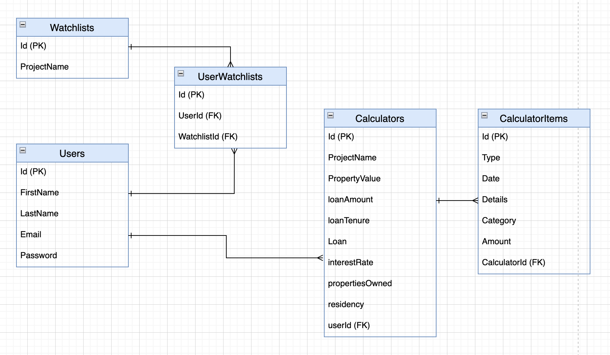

# PropInvest

An app for property investors to track sale and rental transactions in the Singapore market. The objective is to allow investors to make an informed decision on a property before investing by making available to them historical transactions of properties to analyse trends and for landlords, to track the cashflow of a particular project they have invested in.

**Key features**

1. Search through hundreds of properties in Singapore
2. Create a watchlist to track price movement of sale and rental transactions
3. Create an income/expense calculator to monitor cashflow of an investment

The project is build using the PERN stack and utilises REST API.

Visit the app at [PropInvest](https://propinvest-442e8.web.app/).

## Project Repos

- [React Frontend ](https://github.com/wenxi1608/PropInvest) (hosted on Firebase)
- [Express Backend ](https://github.com/wenxi1608/PropInvest-Backend) (hosted on Cyclic)

## Built With

- React
- Express
- Postgresql
- Node.js
- Axios
- Sequelize ORM
- Bcrypt
- CORS
- JWT
- Material UI
- 3rd party API from [URA](https://www.ura.gov.sg/maps/api/#private-residential-property)

## Postgresql ERD

